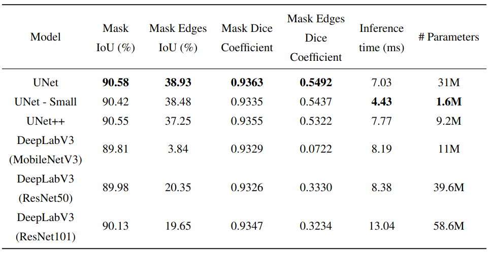

# Deep Learning for Computer Vision

## Introduction
This project focuses on image segmentation of soft-body objects using various convolution neural networks. Specifically, the project uses data from a high-speed imaging camera to perform image segmentation to identify and track a soft-body object, namely the tongue, from static images of mouse faces recorded from a bottom view camera.

## Approach
To perform image segmentation, the project compares different convolution neural networks, including UNet, UNet++, and DeepLabV3, to find a model with the best generalization and test accuracy for the image segmentation task. 

## Results
The performance of different convolutional neural networks (CNNs), including UNet, UNet++, and DeepLabV3, was evaluated on the image segmentation task. The models were trained on the labeled dataset, and their performance was evaluated on a held-out test set using a set of evaluation metrics. The metrics used for comparison included Mask IoU, Mask Edges IoU, Mask Dice Coefficient, inference time (ms) and number of parameters. The quantitative comparison of the models is presented in the table below:

<div style="display: flex; justify-content: center;">
  
</div>

The project successfully identifies and tracks the tongue from the static images of mouse faces using different convolution neural networks. Following is an example visualization of results using UNet - Small model on test data: 

<div style="display: flex; justify-content: center;">
  
  
</div>

The output images show the raw image on the left and the predicted mask overlaid on the raw image on the right.

## Conclusions
In conclusion, this project demonstrates the effectiveness of the best selected convolutional neural network in performing image segmentation for soft-body object.

# Project setup

Use the following to clone the package:
```
git clone https://github.com/Atika-Syeda/DLCV_final_project.git
```
After cloning, the project structure will be as follows:

```
├── notebooks
├── NestedUNet.py
├── README.md
├── dataset.py
├── environment.yml
├── evaluate.py
├── main.py
├── model.py
├── utils.py
```

Next, install anaconda and create a virtual environment as follows:
```
conda env create -f environment.yml
```
To activate the environment for running the package use:
```
conda activate DLCV
```

## I. Download dataset

Please download the dataset from this [link](https://livejohnshopkins-my.sharepoint.com/:f:/g/personal/asyeda1_jh_edu/Esa5boTlaL5Bn869GK80GLsBCsDTT6dUfEl-8W7-BcxVig?e=4Qbo28) and extract the files in the same directory as the code.
After downloading and extracting the dataset the project structure should be as follows:
```
├── data
    ├── bottom
        ├── train
        ├── test
├── notebooks
├── README.md
├── dataset.py
├── environment.yml
├── evaluate.py
├── main.py
├── model.py
├── utils.py
```

## II. Model training

To train the model, run the following command:
```
python3 main.py
```
To modify any default parameters, use the following command:
```
python3 main.py --batch_size <int> --epochs <int> --lr <float> --weight-decay <float> --seed <float> --verbose <bool> --output-dir <filepath> --data-augmentation <bool> --model-weights <filepath> --model-name <str>
```
Use --help to get mpre details for the different tags. The default command `python3 main.py` will save the output of the model/script in a folder called `output` by default. 


## III. Evaluation

To evaluate the trained model, run the following command:

```
python3 evaluate.py
```

The file uses the best model state saved for evaluation. To modify any default parameters, use the following tags:
```
python3 evaluate.py --seed <int> --verbose <bool> --output-dir <filepath> --model-folder <filename> --model-name <str>
```

## IV. Predict
Support added to perform image segmentation on a video (*.mp4, *.avi, *.mov). To run any video use the following command:
```
python3 predict.py --movie <filepath> --model-name <str> --model-state <filepath>
```
Some other features supported by the following tags:
```
python3 predict.py --movie <filepath> --model-name <str> --model-state <filepath> --output-type <str> --fps <int>
```
Use --help to get mpre details for the different tags. The default command will save the output video in the currect folder. 

# References
Please see acknowledgements and reference section in the project report for details.
